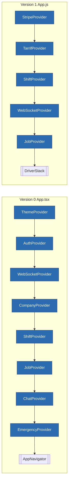
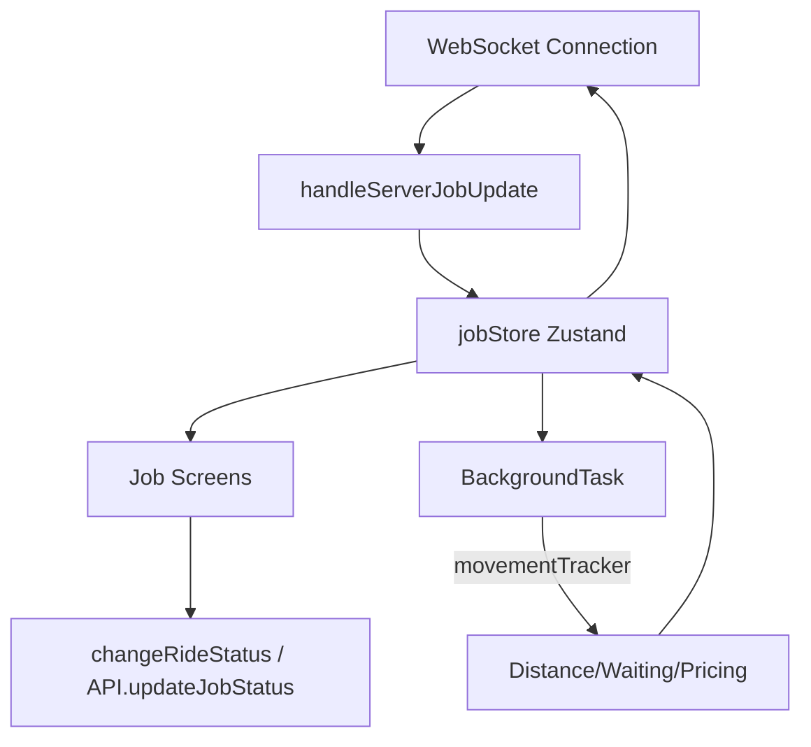

# TaxiTime Driver App — Unified Architecture & Gap Report

**Scope.** This document consolidates the full analysis of both TaxiTime driver applications:
- **Version 0**: `/Applications/A_B_TAXI/DriverAppTemp` (a themable, company-scoped RN app with extensive contexts, tab navigation, and payment scaffolding).
- **Version 1**: `/Applications/A_B_TAXI/TaxiTimeVersiontwo` (a streamlined RN build with advanced background tracking, WebSocket orchestration, and Firebase-centric auth).

The goal is to provide a final, comprehensive view of structure, workflows, parity gaps, and recommended enhancements so that Version 1 can absorb the strengths of Version 0 while retaining its improvements.

---

## 1. Architecture Snapshots

### 1.1 Runtime Composition

**Key takeaway:** V0 exposes a broader provider ecosystem (auth, company, chat, emergency, theme). V1 concentrates on tariff/shift/job, missing broader domain contexts.

### 1.2 Workflow Lifecycle

```mermaid
stateDiagram-v2
    [*] --> Auth: Launch App
    Auth --> Company: Driver selects/validates company (V0 only)
    Auth --> StartShift: V1 assumes Firebase auth; V0 uses backend token
    StartShift --> TariffSelection
    TariffSelection --> Home
    Home --> JobOffer: Offer queue (V0) / single job gating (V1)
    JobOffer --> JobTracking: Accept
    JobOffer --> Home: Reject/auto-expire (V0 queue)
    JobTracking --> Payment: Capture fare (V0 UI only)
    JobTracking --> TripSummary: Review & confirm (V0)
    JobTracking --> Home: Complete job (V1 CompleteJobScreen)
    Home --> Chat/Emergency (V0)
    Home --> Settings/Profile (V0)
    Home --> Logout: Requires shift/job closure
    Logout --> [*]
```

### 1.3 Real-Time & Background Loop

---

## 2. Feature Parity Matrix

| Module / Capability | Version 0 (DriverAppTemp) | Version 1 (TaxiTimeVersiontwo) | Gap / Action |
| --- | --- | --- | --- |
| **Auth** | Email/password, refresh tokens, company binding, shift resume (`AuthContext.js`) | Firebase auth + backend login, no persistent auth context | Recreate consolidated auth context in V1, including token refresh & shift bootstrap. |
| **Company selection** | Dedicated `CompanySelectionScreen`, `CompanyContext` | Missing | Restore in V1 to support multi-company drivers. |
| **Navigation** | `AppNavigator`: auth stack, company stack, main tabs (Home/Profile), modals | `DriverStack`: single stack driven by shift/tariff/job state | Add tabs/settings/payment flows back into V1 navigator for feature parity. |
| **Shift mgmt** | `ShiftContext` with stats, vehicle fetch, server sync | `ShiftContext` (V1) stores driver & vehicles but lacks stats sync | Merge logic so V1 retains stats (earnings, ride count, online time). |
| **Vehicle onboarding** | Onboard/offboard endpoints, manual selection | StartShift uses stored vehicles | Implement consistent vehicle assignment + offboarding in V1. |
| **Tariff selection** | Tariff context + manual refresh + zone detection endpoints | `TarrifContext` with detect API and history logging | Align storage keys/API calls; keep tariff change history exposed. |
| **Job offers** | Pending offer queue, accept/decline with timers, reason codes | Single offer gating; statuses `pending/sending/displayed` | Reintroduce queue + decline reasons into V1’s WebSocket pipeline. |
| **Job tracking** | Map, status controls, Trip summary, Payment screens, audio alerts | Map with advanced metrics (ETA, distance). Completed, paused, resumed states tracked | Combine: retain V1 metrics; add V0 summary/payment UX + sound cues. |
| **Payments** | `PaymentScreen`, Stripe setup guides (implementation pending) | StripeProvider present, no UI screens | Build final payment collection using V0 UI + V1 provider. |
| **Earnings reporting** | `EarningsScreen`, shift stats, API `/mobile/driver/earnings/summary` | Absent | Port earnings UI/API calls into V1. |
| **Chat** | Chat list/detail, unread counts via `ChatContext`, emergency integration | `ChatScreen` & `DetailedChatScreen` direct to Firebase | Re-centralise chat context; maintain unread badges & presence toggles. |
| **Emergency flows** | `EmergencyContext`, emergency screen | Missing | Restore to maintain driver safety requirements. |
| **Theme / branding** | `ThemeContext` for company-specific branding | Not implemented | Reinstate theming for white-label deployments. |
| **Background tracking** | `backgroundLocationService` (5 s polling) | `BackgroundService` + `movementTracker` (adaptive intervals, pricing) | Adopt V1 service wholesale, but include configuration & safety guards. |
| **Offline handling** | Basic job persistence | Offline queueing, NetInfo gating, AsyncStorage `offlineJob` | Ensure offline queue covers payments, chat, shift updates beyond current scope. |

---

## 3. Domain Deep Dive & Improvement Checklist

### 3.1 Authentication & Company Onboarding
- Recreate `AuthContext` in V1 to manage tokens, driver profile, refresh, and active shift rehydration (`DriverAppTemp/src/context/AuthContext.js`).
- Reinstate company selection step before accessing main stack; port `CompanyContext` logic for multi-company drivers.
- Standardise AsyncStorage keys: adopt consistent naming (e.g., `DriverData`, `CompanyId`, `authToken`) to avoid cross-version collisions.

### 3.2 Shift & Vehicle Lifecycle
- Merge V0’s shift stats fetching (`getShiftStatus`, `getEarnings`) with V1’s driver/vehicle store.
- Ensure vehicles can be onboarded/offboarded for each shift, including enforcement before logout/end shift.
- Implement guard rails from V0 (prevent logout with active shift/job) in V1’s contexts.

### 3.3 Job Offer Handling & Tracking
- Combine V0’s job offer modal queue + timers with V1’s `handleServerJobUpdate` pipeline to manage multiple offers and preserve decline reasons.
- Maintain V1 job metric tracking (distance, waiting, tariff history) while adding Trip summary & Payment confirmation screens on completion.
- Harmonise job status enums (V0’s `DRIVER_EN_ROUTE`, etc. vs V1’s `on_the_way`, `arrived_ready`) to match backend contract.

### 3.4 Tariff & Zone Management
- Use V1’s zone detection API (`TarrifZone.DetectZoneAndTariff`) across both versions.
- Keep tariff change history logging; send updates alongside ride-status updates.
- Provide manual refresh & retry logic from V0 Tariff selection.

### 3.5 Payments & Earnings
- Implement Stripe card/NFC collection using V1 `StripeProvider` plus V0 `PaymentScreen`.
- Port `EarningsScreen` & API usage to display daily/weekly/monthly stats and tie into shift summary.
- Ensure Trip summary screen reflects total fare, breakdown, and supports manual adjustments if allowed.

### 3.6 Chat & Emergency Workflows
- Restore `ChatProvider` with centralised listeners and unread counters; adopt V1 Firebase presence updates inside provider.
- Reintroduce Emergency assistance screen & context; integrate with shift state to push emergency alerts (if backend supports).

### 3.7 Settings, Profile & Theming
- Port Settings/Profile screen for account management, documents, help.
- Reinstate `ThemeContext` to support company-specific branding, dark/light overrides, and consistent UI palette.

### 3.8 Background Services & Offline Resilience
- Adopt V1 `BackgroundService.js` and `utils/services/movementTracker.js` across the consolidated app. Add configuration toggles (e.g., interval adjustments, battery saver).
- Extend offline queueing to include chat messages, payments, and shift state so drivers can operate temporarily without connectivity.
- Ensure Firebase presence clean-up (`stopService`) runs on logout and connection failures.

---

## 4. Roadmap

1. **Foundation Alignment**
   - Rebuild shared provider stack: Auth → Company → Theme → Stripe → Tarrif → Shift → WebSocket → Job → Chat → Emergency.
   - Unify AsyncStorage schema and environment configuration (`config/environment.js` in V0 vs constants in V1).

2. **Navigation & Feature Parity**
   - Integrate V0 `AppNavigator` features (tabs, settings, payment, trip summary) into V1’s navigation.
   - Restore Earnings, Chat, Emergency, and Settings screens.

3. **Real-Time & Background Integration**
   - Merge WebSocket logic: keep V1 reconnection & job metrics, reintroduce V0 offer queue + decline events.
   - Finalise background tracking: adopt V1 services, add driver alerts (audioNotificationService) from V0.

4. **Payments & Earnings Completion**
   - Implement card/stripe payment flows, trip summary review, and payout confirmation.
   - Display shift/earnings dashboards with historical data.

5. **Hardening & QA**
   - Consolidate Jest configurations; add integration tests for login, shift start/end, job workflow, payment, chat, and offline scenarios.
   - Instrument logging levels (use `shouldLogApiCalls()` from V0) and add remote monitoring.

6. **Polish & Compliance**
   - Reinstate theming, white-label assets, language support if required.
   - Validate emergency flows, driver safety messaging, and legal compliance checks.

---

## 5. Enhancement Opportunities

1. **Navigation integration**: Implement direct turn-by-turn navigation (deep links to Google Maps/Apple Maps) triggered from Job tracking.
2. **Driver training/onboarding**: Use Theme/Company contexts to deliver customised onboarding or compliance checklists.
3. **Document management**: Extend Settings to include document upload/expiry reminders (leveraging existing backend routes).
4. **Telemetry analytics**: Surface movement tracker insights (idle/stopped time, speed violations) in the driver dashboard.
5. **Push & sound notifications**: Combine V0 audio notification service with push notifications for job offers, chat, and emergencies.

---

## 6. Reference Files (Key Paths)

- **Version 0 (DriverAppTemp)**
  - Shell / Navigation: `App.tsx`, `src/navigation/AppNavigator.js`
  - Contexts: `src/context/AuthContext.js`, `CompanyContext.js`, `ShiftContext.js`, `JobContext.js`, `ChatContext.js`, `EmergencyContext.js`, `ThemeContext.js`
  - Stores & Services: `src/store/jobStore.js`, `src/services/backgroundLocationService.js`, `src/services/api.js`
  - Screens: `src/screens/Auth/*`, `src/screens/Main/*`, `src/screens/Jobs/*`

- **Version 1 (TaxiTimeVersiontwo)**
  - Shell / Navigation: `App.js`, `src/navigation/DriverStack.js`
  - Contexts: `src/context/ShiftContext.js`, `src/context/TarrifContext.js`, `src/context/WebSocketContext.js`, `src/context/jobContext.js`
  - Stores & Services: `src/store/jobStore.js`, `src/store/locationStore.js`, `src/BackgroundService.js`, `src/utils/services/movementTracker.js`, `src/utils/services/socketService.js`
  - Screens: `src/screens/Home/*`, `src/screens/Auth/*`, `src/screens/Chat/*`

---

## 7. Summary

Version 1 delivers a stronger core for real-time operations, background telemetry, and tariff management, but dropped critical application scaffolding that Version 0 had already solved (auth orchestration, company branding, offer queueing, payments, chat, emergency support, earnings dashboards).  

Converging on a unified app requires restoring those missing features in Version 1 while keeping its advanced tracking and WebSocket logic. The roadmap above provides a clear sequence to close parity gaps, harden reliability, and set the stage for new features.

